# Serverless Todo List

Derived from [aws-samples/serverless-tasks-webapp: Getting Started with Serverless Workshop — Tasks web application (github.com)](https://github.com/aws-samples/serverless-tasks-webapp). This project implements a simple to-do list web application that enables user login, task addition and deletion, image uploading, and image recognition. 

I replaced services originally provided by AWS with their open-source equivalents. As such, **AWS Lambda has been replaced by OpenFaaS, S3 by MinIO, Rekognition by TensorFlow, and DynamoDB by MySQL**. We not only preserve the core functionalities but also leverage the flexibility and control offered by open-source alternatives.

## Architecture



| Module       | Public Port    | Local Path     |
| ------------ | -------------- | -------------- |
| NodeJS (vue) | 80             | ClusterIP:8080 |
| OpenFaaS     | 31112          | localhost:8080 |
| MinIO        | 9090 (Console) | ClusterIP:9000 |
| MySQL        | ×              | ClusterIP:3306 |
| TF Serving   | ×              | ClusterIP:8501 |

## Building

The following is an example of Ubuntu 22.04 EC2.

Install the dependencies, they are all necessary components,

```bash
# Install Minikube
curl -LO https://storage.googleapis.com/minikube/releases/latest/minikube-linux-amd64
sudo install minikube-linux-amd64 /usr/local/bin/minikube

# Install kubectl
curl -LO "https://dl.k8s.io/release/$(curl -L -s https://dl.k8s.io/release/stable.txt)/bin/linux/amd64/kubectl"
sudo install -o root -g root -m 0755 kubectl /usr/local/bin/kubectl

# Install Docker socat conntrack
sudo apt-get update 
sudo apt-get install docker.io socat conntrack -y

# Install arkade
curl -sLS https://get.arkade.dev | sudo sh

# Install faas-cli
curl -sL https://cli.openfaas.com | sudo sh

sudo sysctl fs.protected_regular=0
```

Switch to the root user,

```bash
sudo -i
```

Start containers in sequence,

```bash
# frontend container
PUBLIC_IP=$(curl https://ifconfig.me/)
sed -i 's#http://localhost:5000#http://'"$PUBLIC_IP"':31112/function/flask-service#g' webapp/src/gloopts.js

docker build -t todo-frontend ./webapp

# TF model
curl -L "https://tfhub.dev/google/imagenet/efficientnet_v2_imagenet21k_ft1k_s/classification/2?tf-hub-format=compressed" -o efficientnet_v2_imagenet21k_ft1k_s.tar.gz

mkdir -p ./model
tar -xzf efficientnet_v2_imagenet21k_ft1k_s.tar.gz -C ./model
rm efficientnet_v2_imagenet21k_ft1k_s.tar.gz

# Start minikube
minikube start --kubernetes-version=v1.22.0 HTTP_PROXY=https://minikube.sigs.k8s.io/docs/reference/networking/proxy/ --extra-config=apiserver.service-node-port-range=6000-32767 disk=20000MB --vm=true --driver=none

# deploy mysql, minio, tf serving and frontend
cat services.yml | sed s+{{path}}+$(pwd)+g | kubectl apply -f -
kubectl rollout status deploy/frontend-deployment
kubectl port-forward svc/frontend-service 80:8080 --address=0.0.0.0 &

# install openfaas
arkade install openfaas

# Forward the gateway to your machine
kubectl rollout status -n openfaas deploy/gateway
kubectl port-forward -n openfaas svc/gateway 8080:8080 &

echo "> Waiting until Openfaas to launch on 8080"
while ! nc -z localhost 8080; do
	sleep 1
done

# If basic auth is enabled, you can now log into your gateway:
PASSWORD=$(kubectl get secret -n openfaas basic-auth -o jsonpath="{.data.basic-auth-password}" | base64 --decode; echo)
echo -n $PASSWORD | faas-cli login --username admin --password-stdin

# deploy openfaas
faas-cli build -f faas-service.yml
faas-cli deploy -f faas-service.yml
```

### OpenFaaS

You should now be able to access the OpenFaaS administration interface by accessing `public IP: 31112`. Note that the firewall rule for EC2 is set to allow all traffic.

The default username is `admin` and the password is obtained via `echo $PASSWORD`.
